# Competition management tool & stopwatch
... for events such as Ninja Warrior competitions

**Content**
* For the user
  * [Short description](#short-description)
  * [UI Workflow](#ui-workflow)
  * [Installation (in german)](#installation-in-german)
  * [Troubleshooting (in german)](#troubleshooting-in-german)
* For the technically interested person
  * [Modules](#modules)
  * [Classes (static)](#classes-static)
  * [Database entities](#database-entities)
  * [Room for improvement / technical criticism](#room-for-improvement--technical-criticism)

## Short description
This application offers the possibility to
* create events,
* add competitors to events,
* measure how much time competitors need to complete the competition task,
* see the ranking for different categories of competitors (such as male, female, kids)

<table>
<tr><td>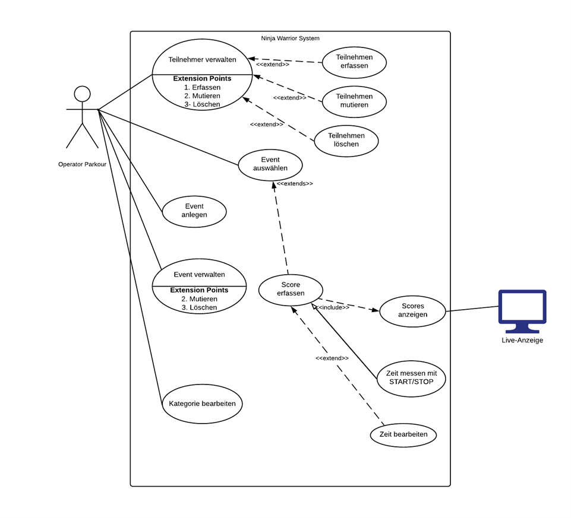</img></td></tr>
<tr><td>Use case diagram (in german)</td></tr>
</table>

<table>
<tr><td>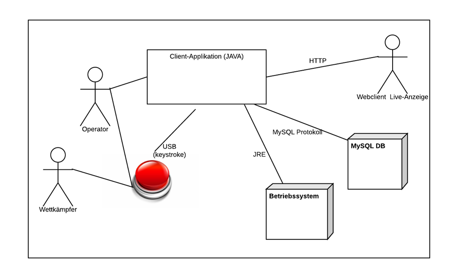</img></td></tr>
<tr><td>Context diagram (in german)</td></tr>
</table>

This project was designed and programmed by Daniel Hoop, Christian Ion and Reto Lässer for the BSc module "Projektarbeit" at FFHS (Fernfachhochschule Schweiz) in 2019.

## UI workflow
The following figure shows possibilities for the user to navigate through different UI screens. In the subsequent figures, screenshots of the different UI screens will be shown.

<table>
<tr><td>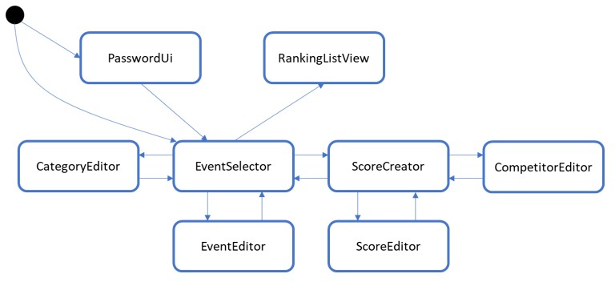</img></td></tr>
<tr><td>UI workflow (state machine diagram)</td></tr>
</table>

Upon the start of the application, the EventSelector appears (if the database password was provided).

<table>
<tr><td>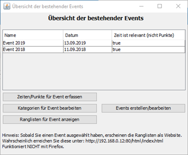</img></td></tr>
<tr><td>EventSelector (UI Screenshot)</td></tr>
</table>

The CategoryEditor offers the possibility to create different categories of competitors. The categories do not have to be mutually exclusive. It is possible, for instance, to create two categories "men" and "women", and, in addition, a category "all" (which contains men and women).

Note: The scores and participants are stored without the corresponding category. Categories only become relevant in the evaluation process. It is therefore possible to edit, add or delete categories during the event.

<table>
<tr><td>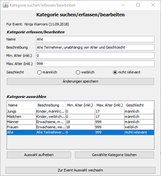</img></td></tr>
<tr><td>CategoryEditor (UI Screenshot)</td></tr>
</table>

To record a score, either the corresponding participant must be clicked in the table, or filtering the table based on name and date of birth must leave only one row. Pressing any key will start/stop the stopwatch. Therefore, a USB button can be used for that purpose. When time recording is on, the background of the UI will turn green. 

By clicking on "Switch to Score Editor" the user will get to the screen where attempts/scores can be modified.

<table>
<tr>
<td>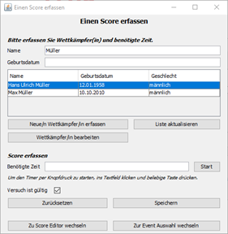</img></td>
<td>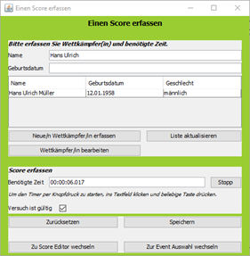</img></td>
</tr>
<tr>
<td>ScoreCreator (one competitor is marked; UI screenshot)</td>
<td>Transpilation and packaging of resources (time is running; UI screenshot)</td>
</tr>
</table>

Scores are searched by the competitor's name or date of birth. Deleted scores are also visible. By clicking on a score (in the upper table) all elements are filled with the corresponding data and can be adjusted. If the competitor attached to the score is to be adjusted, or the score to be deleted, a prompt appears asking if this is really intended.

<table>
<tr><td>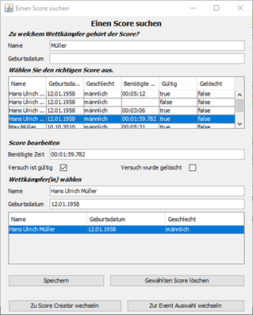</img></td></tr>
<tr><td>ScoreEditor (UI Screenshot)</td></tr>
</table>

By clicking on the button "Edit participant" or "Create new participant" in the ScoreCreator, the user will get to the screen where participants can be edited or newly created.

<table>
<tr><td>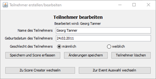</img></td></tr>
<tr><td>CompetitorEditor (UI Screenshot)</td></tr>
</table>

The live display can be reached via `http://HOSTNAME_VON_SERVER/html/index.html` and presents itself as shown in the following figure. The categories are displayed at the top of the screen. The display changes regularly between the rankings of the individual categories. The frequency for this change can be configured in the file: `./bin/html/settings.js`, with the variable named "swapTabInterval". It is also possible to avoid the constant switching between tabs by unchecking the "Auto" checkbox in the top right corner of the website.

<table>
<tr><td>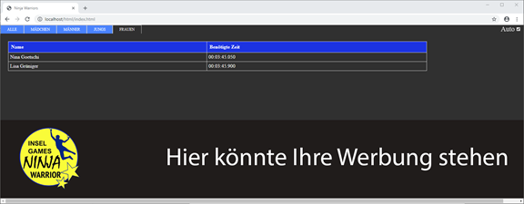</img></td></tr>
<tr><td>Live-Anzeige der Rankings (UI Screenshot)</td></tr>
</table>

The website can also be redesigned by the knowledgeable user by making adjustments to the file `./bin/html/style.css`. It would be conceivable, for example, to make a bright display (instead of a black-dominated one).

## Installation (in german)

### Eigentliche Installation
Die folgenden Verzeichnisse (auf dem ausgelieferten USB-Stick) sind relevant.
  bin			(Ordner)
  installer		(Ordner)
  source		(Ordner)

Spezielle Installationen sind nur auf einem einzigen Computer nötig. Nämlich auf dem Computer, der das Programm ausführt und den Webserver mit der Liveanzeige zur Verfügung stellt. Computer, die nur die Live-Anzeige abrufen möchten, brauchen lediglich einen Webbrowser (z.B. Google Chrome).

Um die Applikation ausführen zu können, sind die folgenden Voraussetzungen nötig:
1. Java 11 muss installiert sein.		-> Für Datenverwaltung und Webserver.
2. MySQL Server muss installiert sein.	-> Für Datenverwaltung und Webserver.
3. Ein Browser muss installiert sein.	-> Für Abrufen der Live Anzeige.

Die Installer für Java 11 und MySQL finden Sie im Ordner ‘installer’. Google Chrome kann hier heruntergeladen werden.

MySQL: Richten Sie einen Datenbankbenutzer ein, der alle Rechte auf der Datenbank hat. Dies ist wichtig, weil die Applikation sonst womöglich nicht ordnungsgemäss funktioniert.

Die Applikation selbst muss nicht installiert werden, sondern ist als lauffähiges Java-Archiv im Unterordner ‘bin’ enthalten.

Wenn Sie planen, dass auf dem einen Computer die Wettkampf-Daten erfasst werden (und dort auch der Webserver drauf läuft) und auf anderen Computern die Live-Anzeige angezeigt wird, dann müssen sich die Computer entweder im selben Netzwerk befinden, oder der Computer, auf dem der Webserver läuft, vom Internet aus erreichbar sein. Achten Sie darauf, dass der Webserver nicht durch Firewall-Richtlinien blockiert wird.

### Werbung platzieren
Wenn der Event gesponsort wird, möchte der Sponsor möglicherweise sein Firmenlogo auf der Leinwand mit der Live-Anzeige sehen. Dies kann konfiguriert werden, indem die Datei `./bin/html/werbung.jpg` mit dem Firmen-Logo des Sponsors ausgetauscht wird. Der Name dieser Datei darf nicht verändert werden, da sie sonst nicht von der Applikation erkannt wird.

### Starten der Applikation
Die Applikation wird gestartet, indem die Batch-Datei `./bin/start.bat` ausgeführt wird. Diese Datei ruft wiederum die eigentliche Applikation auf (`./bin/CompetitionManager.jar`). Auf diese Weise wird die Applikation beim Start richtig konfiguriert. Die Argumente in `./bin/start.bat` sind wie der folgenden Tabelle aufgeführt.

Tabelle: Argumente beim Programmstart  
| Argument-Name	| Kommentar |  
| ------------ | ----------- |  
| user | Geben Sie hier den MySQL-Benutzernamen ein, den sie bei der MySQL-Installation festgelegt haben. |  
| password | Optional: Geben Sie hier das MySQL-Passwort ein, das sie bei der MySQL-Installation festgelegt haben. Wenn Sie das Passwort nicht angegeben möchten, wird es beim Applikationsstart in einem Prompt abgefragt. |  
| httpPort | Optional: Spezifizieren Sie den Port auf dem der Webserver erreichbar sein soll. Wenn nicht angegeben, dann ist es der Port 80. |  
| address | Ändern Sie dieses Argument nicht. Ausser, wenn der Datenbankserver nicht auf dem üblichen MySQL-Port 3306 läuft. - Default: Siehe Batch-Datei. |  
| driverPath | Ändern Sie dieses Argument nicht. Es handelt sich um den Pfad zum Datenbank-Treiber. - Default: "./driver/mysql-connector-java-8.0.17.jar" |  
| driverName | Ändern Sie dieses Argument nicht. Es handelt sich um den Klassennamen des Datenbanktreibers. - Default: "com.mysql.cj.jdbc.Driver" |  

Beim ersten Programmstart nach der Installation des MySQL-Servers wird ein Fehler auftreten (siehe Abbildung 1). Das ist normal und liegt daran, dass das Datenbankschema noch nicht besteht. Klicken Sie auf «OK». Sollte der Fehler weiterhin auftauchen, versuchen Sie die Lösungsansätze aus, die in Sektion «Troubleshooting» aufgeführt sind.

<table>
<tr><td>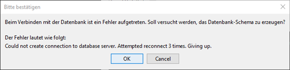</img></td></tr>
<tr><td>Fehler beim ersten Programmstart</td></tr>
</table>

## Troubleshooting (in german)
**Die Live-Anzeige wird nicht angezeigt (wie etwa in der folgenden Abbildung zu sehen)**

<table>
<tr><td>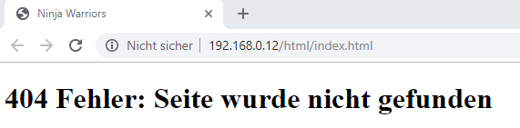</img></td></tr>
<tr><td>Fehler bei Live-Anzeige</td></tr>
</table>

Dies kann mehrere Ursachen haben.
* Der Unterordner `.\bin\html` existiert nicht. Haben Sie diesen Ordner gelöscht? Er sollte auf dem USB-Stick vorhanden sein.  
  Lösung: Kopieren Sie den Ordner inkl. Inhalt noch einmal. 
* Sie haben nicht die richtige IP-Adresse des Webservers in die Adresszeile des Browsers eingegeben. Überprüfen Sie, ob sie auf dem Computer, der den Webserver zur Verfügung stellt, die Ranglisten sehen können und zwar, indem Sie folgende Adresse in die Adresszeile des Browsers eingeben: «localhost:80», wobei 80 der Port ist. Wenn sie einen anderen Port konfiguriert haben, geben Sie diesen ein. Wenn die Seite jetzt korrekt erscheint, wissen Sie, dass das Problem vorher an einer falschen Adresse lag.  
  Lösung: Finden Sie die richtige Adresse des Webservers. Öffnen Sie dafür z.B. den Windows command prompt und führen Sie den Befehl ‘ipconfig’ aus.  
  Hinweis: Den Windows command prompt finden sie, indem sie auf das Windows-Symbol klicken und ‘cmd’ eingeben.
Üblicherweise beginnt die IPv4-Adresse in einem Heimnetzwerk mit «192.168.0» (siehe nächste Abbildung).

<table>
<tr><td>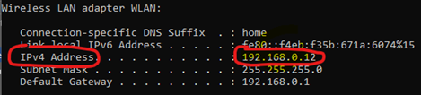 ipconfig"></img></td></tr>
<tr><td>Output von cmd > ipconfig</td></tr>
</table>

* Sie nutzen den falschen Port.  
  Lösung: Der Port der Live-Anzeige kann beim Applikationsstart mit dem Argument ‘httpPort’ konfiguriert werden. Wenn der Port nicht angegeben wird, wird der Port 80 verwendet. Prüfen Sie beim Abrufen der Live-Anzeige den Port und stellen Sie sicher, dass er mit dem Port des Webservers übereinstimmt. Den Port 88 spezifizieren Sie im Adressfeld eines Browsers bspw. wie folgt:  
  http://192.168.0.1:88

* Es besteht ein Netzwerkproblem. Der Computer, der die Live-Anzeige aufrufen möchte, erreicht den Webserver nicht.  
  Lösung: Stellen Sie sicher, dass der Webserver nicht durch eine Firewall blockiert wird. Stellen Sie sicher, dass der Switch/Router Netzwerkverkehr zwischen den beiden Computern zulässt.

* Sie nutzen Mozilla Firefox. Die Live-Anzeige funktioniert nicht mit Mozilla Firefox.  
  Lösung: Nutzen Sie einen anderen Browser, z.B. Google Chrome.

**Der Befehl “java” ist entweder falsch geschrieben oder konnte nicht gefunden werden.**  
**Englisch: ‘java' is not recognized as an internal or external command**

Dieser Fehler tritt auf, wenn Java entweder nicht installiert ist, oder nicht zur «Path»-Variable hinzugefügt wurde.

* Lösung 1: Installieren Sie Java.  
* Lösung 2.1: Klick auf Windows Symbol -> «Umgebungsvariablen» eingeben und anklicken -> Unter Systemvariablen die Variable «Path» anklicken -> Bearbeiten -> Den «bin»-Pfad der Java-Installation hinzufügen. Z.B. «C:\Program Files\Java\jdk-11.0.4\bin»  
* Lösung 2.2: Alternativ zum ändern der Path Variable können Sie beim Programmaufruf statt nur «java» auch den Vollen Pfad zu java.exe einfügen, der Befehlsaufruf wäre dann ungefähr wie folgt: "C:\Program Files\Java\jdk-11.0.4\bin\java.exe" -jar  

**Could not create connection to database server. Attempted reconnect 3 times. Giving up.**  
Sie erreichen den Datenbank-Server nicht. Dies kann mehrere Ursachen haben.

* Sie haben die Datenbank-Adresse oder den Port falsch eingegeben.  
  Lösung: Orientieren Sie sich an der Vorlage in der Daten «start.bat». Wenn Sie MySQL normal installiert haben, sollte der Datenbankserver so erreichbar sein.
jdbc:mysql://localhost:3306/CompetitionManager

* Sie haben einen falschen Benutzer oder das falsche Passwort angegeben.  
  Lösung: Prüfen und korrigieren Sie ggf. Benutzername und Passwort.

* Der Datenbankserver läuft nicht.  
  Klick auf das Windows-Symbol -> «Dienste» suchen und auswählen -> Zu «MySQL» scrollen. Der Dienst heisst wahrscheinlich «MySQL80» -> Rechtsklick -> Starten

## Modules
<table>
<tr><td>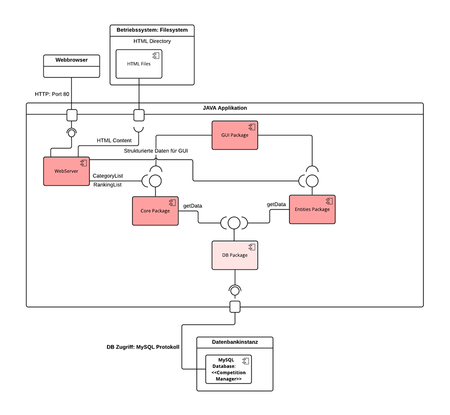</img></td></tr>
<tr><td>Project modules</td></tr>
</table>

## Classes (static)
### Overiew
<table>
<tr><td>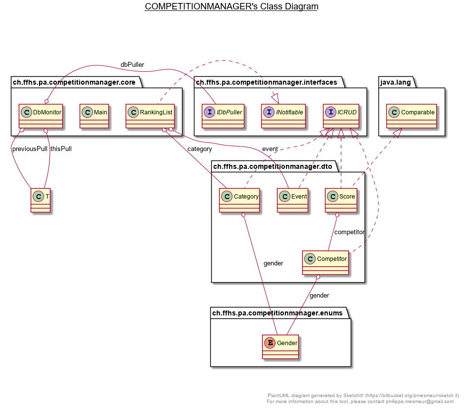</img></td></tr>
<tr><td>Class diagram (project overview)</td></tr>
</table>

### Core business logic
<table>
<tr><td>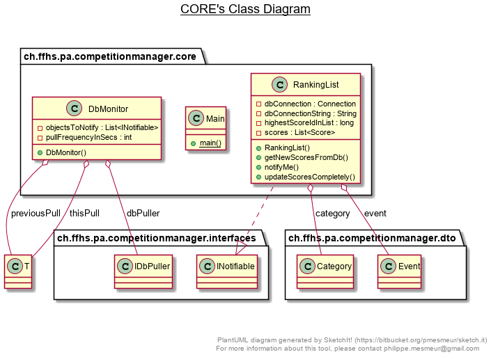</img></td></tr>
<tr><td>Core business logic (class diagram)</td></tr>
</table>

### Entities / Data Transfer Objects (DTOs)
<table>
<tr><td>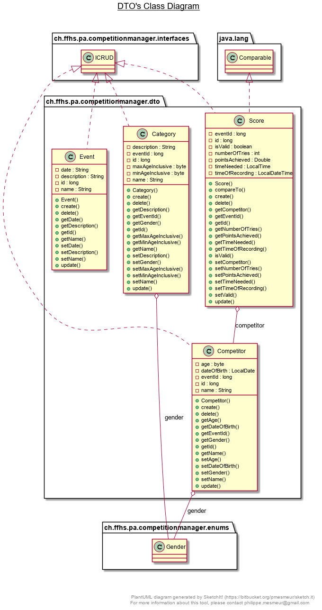</img></td></tr>
<tr><td>Entities / data transfer objects (class diagram)</td></tr>
</table>

## Database entities
<table>
<tr><td>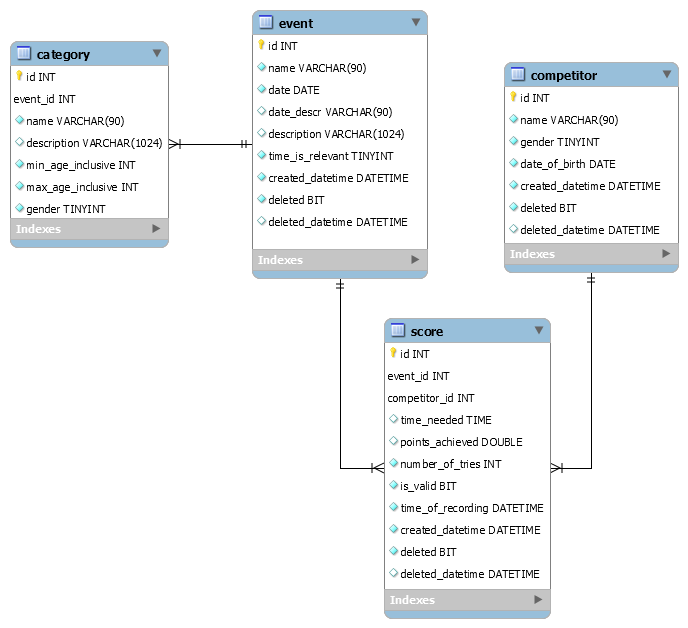</img></td></tr>
<tr><td>Database entitites (entity relationship diagram ERD)</td></tr>
</table>

## Room for improvement / technical criticism
* The application is not protected against SQL injection. That is, the class `db.Query` and its methods take arguments as is and insert them directly into a SQL query which will be excuted. However, as this application is meant to be used in small trustworthy teams, and the databases are not shared between different teams, the likelihood and impact of an SQL injection attack is limited.
* No object relation mapper (ORM) is used.
* The GUI (apart from the live ranking) is based on Java (e.g. JFrame, JPanel, etc.). This is unfortunate because it requires all users to have a Java installation on their computers and to have a working configuration file (including the database password). It is therefore more likely that users experience problems - compared to a HTML solution hosted on one specific server. In addition, it makes it hard/impossible to use the application with mobile devices such as tables or smartphones.